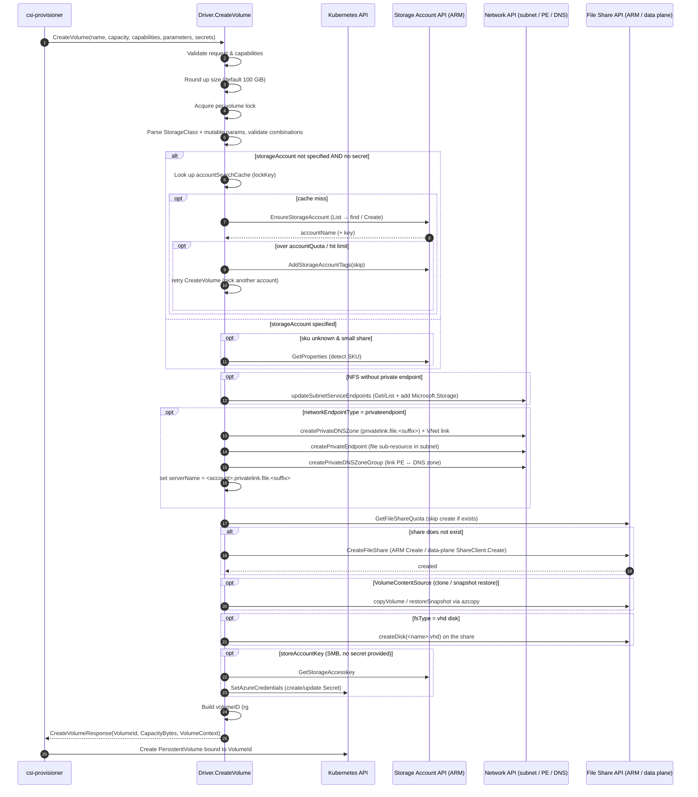

# CreateVolume Workflow

This document traces the full path of a `CreateVolume` RPC in the Azure File
CSI driver — from the moment the external `csi-provisioner` sidecar issues the
gRPC call, through the Azure (and Kubernetes) APIs the driver invokes, to the
`CreateVolumeResponse` that is returned.

The controller-side entry point is `Driver.CreateVolume` in
[`pkg/azurefile/controllerserver.go`](../pkg/azurefile/controllerserver.go).

---

## 1. High-level flow

```
csi-provisioner (external sidecar, watches PVCs)
        │  gRPC: CreateVolume(name, capacity, volume_capabilities, parameters, secrets, ...)
        ▼
Driver.CreateVolume()                         pkg/azurefile/controllerserver.go
        │
        ├─ 1. Validate request & capabilities
        ├─ 2. Round up requested size (default 100 GiB if unset)
        ├─ 3. Acquire per-volume lock (volumeLocks)
        ├─ 4. Parse StorageClass parameters + VolumeAttributesClass mutable params
        ├─ 5. Validate parameter combinations (protocol, sku, tiers, ...)
        ├─ 6. Resolve account / resourceGroup / share name (see §3)
        ├─ 7. EnsureStorageAccount()  ──────────► Azure Storage Account ARM API (create/find)
        │        (only when no secret and no explicit storageAccount)
        ├─ 8. (private endpoint) create PE + private DNS zone/group (see §4)
        ├─ 9. getFileShareQuota() / CreateFileShare() ──► Azure File Share API (ARM or data plane)
        ├─ 10. (optional) copyVolume() / restoreSnapshot() via azcopy
        ├─ 11. (optional) createDisk() for VHD fsType
        ├─ 12. (optional) SetAzureCredentials() ──► Kubernetes Secret (store account key)
        └─ 13. Build volumeID and return CreateVolumeResponse
        ▼
csi-provisioner creates the PV object bound to the returned volumeID
```

### Sequence diagram



---

## 2. Azure / Kubernetes APIs used to create the file share

The driver never talks to Azure over a single API surface. Depending on the
parameters and credentials it selects one of three client paths, all wired
through `Driver.CreateFileShare`
([`pkg/azurefile/azurefile.go`](pkg/azurefile/azurefile.go), ~L1115) which wraps
the call in an exponential backoff and first calls `GetFileShareQuota` to skip
creation if the share already exists.

| Client path | When it is used | Underlying API | Code |
|-------------|-----------------|----------------|------|
| **Management plane (ARM)** — *default* | No `secrets` passed and `useDataPlaneAPI` not set | `Microsoft.Storage` ARM `fileShares.Create` via `fileshareclient.Interface` | `azureFileMgmtClient.CreateFileShare` in [`azurefile_mgmt_client.go`](../pkg/azurefile/azurefile_mgmt_client.go) |
| **Data plane (shared key)** | `secrets` provided, or `useDataPlaneAPI=true` in the StorageClass | `azfile` SDK `service.Client` → `ShareClient.Create` (REST to `https://<account>.file.<suffix>`) authenticated with account key | `azureFileDataplaneClient.CreateFileShare` in [`azurefile_dataplane_client.go`](../pkg/azurefile/azurefile_dataplane_client.go) |
| **Data plane (OAuth)** | `useDataPlaneAPI=oauth` and an `AuthProvider` is configured | Same `azfile` SDK but authenticated with an AAD token (`newAzureFileClientWithOAuth`) | `azurefile.go` L1132 |

Other Azure APIs invoked around share creation:

- **`EnsureStorageAccount`** (`d.cloud.EnsureStorageAccount`, from
  cloud-provider-azure
  [`azure_storageaccount.go`](../vendor/sigs.k8s.io/cloud-provider-azure/pkg/provider/storage/azure_storageaccount.go)):
  lists existing accounts (`storageAccountClient.List`) to find a matching one,
  or creates a new one (`storageAccountClient.Create`). It also fetches account
  keys (`GetStorageAccesskey`).
- **`GetProperties`** on the storage account — used to detect the SKU when an
  existing account is provided but no `skuName` is set, and for the private
  endpoint flow.
- **`GetStorageAccesskey`** — retrieves the account key when it must be stored
  in a Kubernetes secret, used for the data-plane client, or needed for VHD
  disk creation.
- **`updateSubnetServiceEndpoints`** ([`azure.go`](../pkg/azurefile/azure.go) L210)
  — for NFS shares *without* a private endpoint, it reads/updates the subnet
  (`SubnetClient.Get`/`List`) to add the `Microsoft.Storage` service endpoint
  and returns `VirtualNetworkResourceIDs` used for the account firewall.
- **`GetTotalAccountQuota`** — when `accountQuota` is set, sums existing share
  quota to decide whether to skip an account that is too full.
- **`AddStorageAccountTags`** — tags an account with `skip` when it hit a share
  or account limit so subsequent retries pick a different account.
- **Kubernetes `SetAzureCredentials`** — writes the account name/key into a
  Kubernetes `Secret` (default `azure-storage-account-<account>-secret`) unless
  `storeAccountKey=false`, NFS, or identity-based mounts are used.
- **azcopy** (`copyVolume` / `restoreSnapshot`) — only when the request has a
  `VolumeContentSource` (clone or snapshot restore); data is copied share→share
  using a SAS token or identity-based auth.

---

## 3. Behavior of `storageAccount`, `resourceGroup`, and `shareName` parameters

These three StorageClass parameters control *where* and *under what name* the
file share is provisioned. The driver has well-defined behavior whether or not
the user specifies each one.

### `resourceGroup`

- **Specified:** used directly as `accountOptions.ResourceGroup` and later
  encoded into the `volumeID`.
- **Not specified:** defaults to the driver's configured resource group
  (`d.cloud.ResourceGroup`) — see `controllerserver.go` (`if resourceGroup == ""`).
- **Cross-subscription rule:** if `subscriptionID` is set and differs from the
  driver's subscription, `resourceGroup` **must** be provided, otherwise the
  request fails with `InvalidArgument`.

### `storageAccount`

- **Specified (`account != ""`):**
  - The driver **does not run account discovery/`EnsureStorageAccount`** in the
    "find or create" search path. It uses the named account directly.
  - `matchTags` must be `false` (validated — cannot match tags against an
    explicit account).
  - If `skuName` is not set and the share is small, the driver calls
    `GetProperties` to learn the account's SKU.
  - The account key is still fetched on demand (for data-plane API, storing the
    secret, or VHD disk creation).
- **Not specified:**
  - The driver builds a `lockKey` from all account-shaping parameters (sku,
    kind, rg, location, protocol, private-endpoint flag, encryption flags, tags,
    endpoint suffix, ...) and looks in `accountSearchCache`.
  - On a cache miss it calls **`EnsureStorageAccount`**, which **finds an
    existing matching account or creates a new one** with the auto-generated
    prefix `defaultAccountNamePrefix` (`f<...>`). The result is cached in
    `accountSearchCache` and `volMap` so repeated calls for the same volume are
    stable.
  - If the chosen account exceeds `accountQuota` or hits the share/account
    limit, it is tagged `skip` and `CreateVolume` is **retried recursively** to
    pick/create another account.

### `shareName`

- **Specified (`fileShareName != ""`):**
  - PV/PVC name/namespace metadata templates (e.g. `${pvc.metadata.name}`) are
    substituted via `replaceWithMap`.
  - Because the share name is fixed, the volume name is appended to the
    `volumeID` as a `uuid` suffix so distinct PVs sharing a name are
    distinguishable.
  - For VHD (`fsType` disk) volumes, a random UUID `.vhd` disk name is used.
- **Not specified:** the driver **derives the share name from the volume name**
  (`req.GetName()`, typically `pvc-<uuid>`) via `getValidFileShareName`:
  - `shareNamePrefix` (if set) → `"<prefix>-<volName>"`.
  - NFS protocol → `pvc` prefix rewritten to `pvcn`.
  - VHD disk fsType → `pvc` prefix rewritten to `pvcd`.
  - For VHD without an explicit shareName, the disk file is named
    `<shareName>.vhd`.

### Related size behavior

- If no capacity is requested, the default is `defaultAzureFileQuota` (100 GiB).
- Premium (non-v2) shares are bumped to `minimumPremiumShareSize`; v2 SKUs are
  bumped to `minimumV2ShareSize` and get default IOPS/bandwidth if unset.
- The response returns the **actual provisioned capacity**, which may be larger
  than requested due to these minimums.

---

## 4. Private endpoint scenario

A private endpoint is requested by setting `networkEndpointType: privateendpoint`
in the StorageClass. Key handling in `CreateVolume` and `EnsureStorageAccount`:

1. **Validation / flag setup** (`controllerserver.go`):
   - `createPrivateEndpoint` is set to `true`.
   - `subnetName` may contain **only one** subnet (comma-separated list is
     rejected for private endpoints).
   - `privateDNSZoneResourceGroup` is **only** allowed when a private endpoint
     is requested; setting it otherwise fails with `InvalidArgument`.

2. **NFS + private endpoint:** the subnet service-endpoint update
   (`updateSubnetServiceEndpoints`) is **skipped** — with a private endpoint the
   storage account firewall relies on the PE rather than VNet service endpoints.

3. **Account creation with locked-down networking**
   (`EnsureStorageAccount` in cloud-provider-azure): when
   `CreatePrivateEndpoint` is true the new account's `NetworkRuleSet` default
   action is set to **`Deny`** (public access blocked), and the driver then
   provisions the private networking resources:
   - **`createPrivateDNSZone`** — creates the `privatelink.file.<suffix>`
     private DNS zone (in `privateDNSZoneResourceGroup`, defaulting to the vnet
     resource group) and a VNet link.
   - **`createPrivateEndpoint`** — creates the private endpoint against the
     storage account's `file` sub-resource in the configured subnet.
   - **`createPrivateDNSZoneGroup`** — links the private endpoint to the private
     DNS zone so `<account>.file.<suffix>` resolves to the private IP.

4. **serverName override:** back in `CreateVolume`, when
   `createPrivateEndpoint` is true the driver injects
   `serverNameField = "<account>.privatelink.file.<suffix>"` into the volume
   context/parameters so the node stage step mounts using the private-link FQDN.

5. **Account matching:** when searching for an existing account,
   `isStorageTypeEqual`/private-endpoint matching in cloud-provider-azure only
   reuses accounts whose private-endpoint state matches the request (accounts
   with a PE for `CreatePrivateEndpoint=true`, accounts without one otherwise).

---

## 5. Response

On success the driver builds the `volumeID` using `volumeIDTemplate`:

```
<resourceGroup>#<accountName>#<fileShareName>#<diskName>#<uuid>#<secretNamespace>
```

(with `#<subscriptionID>` appended for cross-subscription volumes), records the
data-plane preference in `dataPlaneAPIVolMap` when applicable, and returns:

```go
&csi.CreateVolumeResponse{
    Volume: &csi.Volume{
        VolumeId:      volumeID,
        CapacityBytes: actualCapacityBytes, // may be rounded up to a minimum
        VolumeContext: parameters,          // incl. serverName, secretNamespace, diskName, ...
        ContentSource: req.GetVolumeContentSource(),
    },
}
```

`csi-provisioner` then creates the Kubernetes `PersistentVolume` bound to this
`VolumeId`, and the `VolumeContext` is later consumed by `NodeStageVolume` /
`NodePublishVolume` to mount the share.
