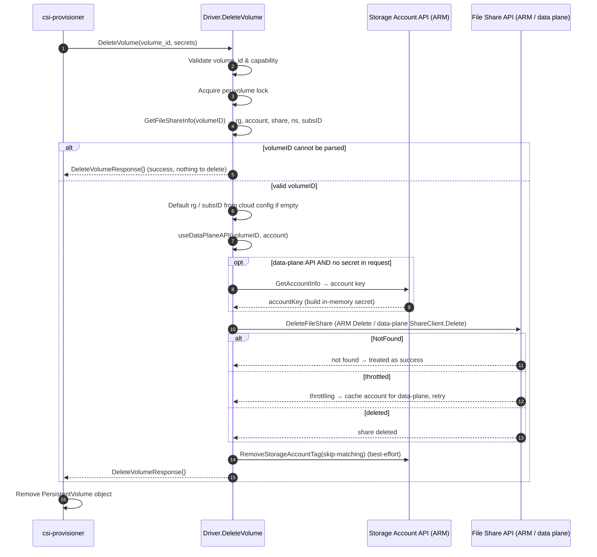

# DeleteVolume Workflow

This document traces the full path of a `DeleteVolume` RPC in the Azure File
CSI driver — from the moment the external `csi-provisioner` sidecar issues the
gRPC call, through the Azure (and Kubernetes) APIs the driver invokes, to the
`DeleteVolumeResponse` that is returned.

The controller-side entry point is `Driver.DeleteVolume` in
[`pkg/azurefile/controllerserver.go`](../pkg/azurefile/controllerserver.go).

---

## 1. High-level flow

```
csi-provisioner (external sidecar, watches PV deletions with Delete reclaim policy)
        │  gRPC: DeleteVolume(volume_id, secrets)
        ▼
Driver.DeleteVolume()                          pkg/azurefile/controllerserver.go
        │
        ├─ 1. Validate volume_id present & CREATE_DELETE_VOLUME capability
        ├─ 2. Acquire per-volume lock (volumeLocks, keyed by volumeID)
        ├─ 3. GetFileShareInfo(volumeID) → rg, account, shareName, ns, subsID (see §3)
        │        (invalid id ⇒ return success, per CSI sanity semantics)
        ├─ 4. Default resourceGroup / subscriptionID from cloud config if empty
        ├─ 5. Resolve data-plane vs management-plane (useDataPlaneAPI) (see §2)
        │        └─ if data plane & no secret: GetAccountInfo() ──► fetch account key
        ├─ 6. DeleteFileShare() ──────────────► Azure File Share API (ARM / data plane)
        │        (NotFound treated as success; throttling ⇒ switch to data plane)
        ├─ 7. RemoveStorageAccountTag(skip-matching) ──► Azure Storage Account ARM API
        └─ 8. Return empty DeleteVolumeResponse
        ▼
csi-provisioner removes the PV object
```

> **Important:** `DeleteVolume` deletes **only the file share**. It does **not**
> delete the storage account (the account may host many shares and is reused),
> and it does **not** delete the Kubernetes account-key secret created during
> `CreateVolume`.

### Sequence diagram



---

## 2. Azure / Kubernetes APIs used to delete the file share

As with creation, the driver selects one of three client paths inside
`Driver.DeleteFileShare`
([`pkg/azurefile/azurefile.go`](../pkg/azurefile/azurefile.go), ~L1167), all
wrapped in an exponential backoff (`wait.ExponentialBackoff`).

| Client path | When it is used | Underlying API | Code |
|-------------|-----------------|----------------|------|
| **Data plane (shared key)** | `secrets` provided in the request | `azfile` SDK `ShareClient.Delete` (REST to `https://<account>.file.<suffix>`) authenticated with account key | `azureFileDataplaneClient.DeleteFileShare` in [`azurefile_dataplane_client.go`](../pkg/azurefile/azurefile_dataplane_client.go) |
| **Data plane (OAuth)** | `useDataPlaneAPI=oauth` and an `AuthProvider` is configured | Same `azfile` SDK, authenticated with an AAD token (`newAzureFileClientWithOAuth`) | `azurefile.go` (`DeleteFileShare`) |
| **Management plane (ARM)** — *default* | Otherwise | `Microsoft.Storage` ARM `fileShares.Delete` via `fileshareclient.Interface` | `getFileShareClientForSub(...).Delete` in `azurefile.go` |

Other APIs / behaviors invoked around deletion:

- **`GetAccountInfo`** ([`azurefile.go`](../pkg/azurefile/azurefile.go) L847) —
  only when `useDataPlaneAPI=true` and no secret was supplied in the request.
  It parses the volumeID and reads the account key (via the storage account
  ARM API / secret) so an in-memory shared-key secret can be built for the
  data-plane delete.
- **`RemoveStorageAccountTag`** ([`azurefile.go`](../pkg/azurefile/azurefile.go)
  L1359 → cloud-provider-azure
  [`azure_storageaccount.go`](../vendor/sigs.k8s.io/cloud-provider-azure/pkg/provider/storage/azure_storageaccount.go)
  L905) — best-effort removal of the `skip-matching` (`storage.SkipMatchingTag`)
  tag from the account. This tag is added during `CreateVolume` when an account
  hits a share/account limit; removing it after a share is deleted lets the
  account become eligible for matching again. Guarded by `skipMatchingTagCache`
  to avoid churn, and failures are only logged (do not fail the RPC).

### Error handling notable points (`DeleteFileShare`)

- **NotFound is success:** if the share is already gone (`statusCodeNotFound`,
  `httpCodeNotFound`, or `fileShareNotFound`), the delete returns success — so
  `DeleteVolume` is idempotent.
- **Throttling ⇒ data-plane fallback:** on a throttling error the account is
  added to `dataPlaneAPIAccountCache`, so subsequent operations on that account
  use the data-plane API instead of ARM.
- **Retriable errors** are retried via the exponential backoff.

---

## 3. Parsing the volumeID (`storageAccount`, `resourceGroup`, `shareName`)

`DeleteVolume` receives only the opaque `volume_id` produced by `CreateVolume`;
all placement information is recovered by `GetFileShareInfo`
([`azurefile.go`](../pkg/azurefile/azurefile.go) L560), which splits the id on
`#`:

```
<resourceGroup>#<accountName>#<fileShareName>#<diskName>#<uuid|namespace>#<secretNamespace>[#<subscriptionID>]
```

- **`resourceGroup` (segment 0):** if empty, defaults to the driver's configured
  `d.cloud.ResourceGroup`. (An empty leading segment also signals a CSI-migration
  in-tree id, where the namespace shifts to segment 4.)
- **`accountName` (segment 1)** and **`fileShareName` (segment 2):** required —
  these identify exactly which share to delete. The account is **not** removed,
  only this share.
- **`subscriptionID`:** taken from the trailing segment when present; if it is
  not a valid subscription id, it defaults to `d.cloud.SubscriptionID`. Cross-
  subscription deletes therefore target the subscription encoded in the id.
- **`secretNamespace`:** used only to build the data-plane request context when
  fetching the account key.
- **Unparseable id:** per the CSI Driver Sanity Tester, an invalid volume id is
  **not** an error — the driver logs it and returns an empty
  `DeleteVolumeResponse{}` (nothing to delete).

Note that `CreateVolume` appends the volume name as a `uuid` suffix to the
volumeID **only when `shareName` was explicitly set** in the StorageClass; for
dynamically named shares the share name already embeds the volume name. Either
way, `DeleteVolume` simply deletes the `fileShareName` decoded from the id.

---

## 4. Private endpoint scenario

Deletion is largely symmetric-agnostic to the private endpoint setup:

- The **file share** delete goes through the same ARM/data-plane client. When
  the driver reaches the account over a **private endpoint** (public access
  denied), the management-plane `fileShares.Delete` still works because it is an
  ARM control-plane call; the data-plane path (used when secrets are supplied or
  under throttling) resolves `<account>.file.<suffix>` through the
  `privatelink.file.<suffix>` private DNS zone created during `CreateVolume`.
- `DeleteVolume` does **not** tear down the private endpoint, the private DNS
  zone, the DNS zone group, or the VNet link. Those resources are provisioned at
  account scope during `CreateVolume`/`EnsureStorageAccount` and are left intact
  because the storage account itself is not deleted.
- Because the storage account is preserved, any subnet service endpoints added
  for NFS shares are likewise left unchanged.

---

## 5. Response

On success (including the idempotent NotFound and unparseable-id cases) the
driver returns an empty response:

```go
&csi.DeleteVolumeResponse{}
```

`csi-provisioner` then deletes the Kubernetes `PersistentVolume` object. The
storage account and any Kubernetes account-key secret created during
provisioning remain and must be cleaned up separately if no longer needed.
