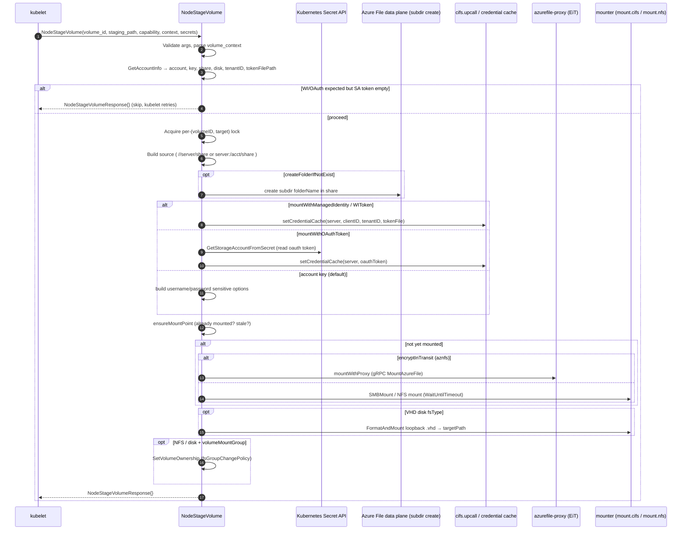
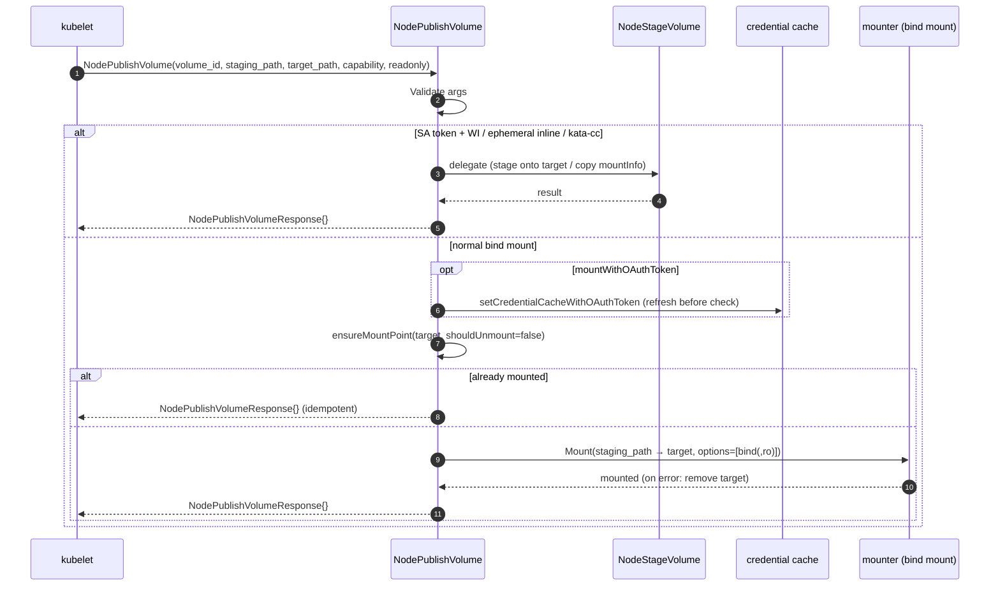

# NodeStageVolume & NodePublishVolume Workflow

This document traces the node-side mount path of the Azure File CSI driver —
from the moment the kubelet issues `NodeStageVolume` / `NodePublishVolume` gRPC
calls, through the credential resolution and mount logic, to the responses that
are returned.

The node-side entry points live in
[`pkg/azurefile/nodeserver.go`](../pkg/azurefile/nodeserver.go):

- `Driver.NodeStageVolume` (~L278) — mounts the Azure file share **once per node**
  onto the **staging** path.
- `Driver.NodePublishVolume` (~L64) — **bind-mounts** the staged path into each
  pod's **target** path.

---

## 0. Where these fit in the CSI node lifecycle

```
kubelet (per pod that references the PV)
   │
   ├─ NodeStageVolume(volume_id, staging_target_path, volume_capability, volume_context, secrets)
   │      → real CIFS/NFS mount of the share onto the global staging path (once per node)
   │
   └─ NodePublishVolume(volume_id, staging_target_path, target_path, volume_capability, readonly)
          → bind mount from staging path into the pod's target path (once per pod)
```

`NodeStageVolume` does the heavy lifting (authentication + the actual network
mount). `NodePublishVolume` is normally just a **bind mount** of the already
staged directory — except for the special inline/identity/kata paths described
in §4, where it delegates back to `NodeStageVolume`.

---

## 1. NodeStageVolume — high-level flow

```
NodeStageVolume()                              pkg/azurefile/nodeserver.go
   │
   ├─ 1. Validate volume_id, staging_target_path, volume_capability
   ├─ 2. If WI/OAuth expected but SA token empty → return success (skip, retried later)
   ├─ 3. Compute mount flags (ro, gid=<volumeMountGroup>)
   ├─ 4. GetAccountInfo(volumeID, secrets, context) → account, key, share, disk, tenantID, tokenFilePath
   ├─ 5. Parse volume_context (protocol, fsType, server, folderName, mountPermissions,
   │        auth flags: mountWithManagedIdentity / mountWithWIToken / mountWithOAuthToken, ...)
   ├─ 6. Validate fsType / protocol / fsGroupChangePolicy / auth-flag exclusivity
   ├─ 7. Acquire per-(volumeID,targetPath) lock
   ├─ 8. Build mount source:
   │        SMB : //<server>/<share>[/<folder>]        (server = <account>.file.<suffix>)
   │        NFS : <server>:/<account>/<share>[/<folder>]
   │        (createFolderIfNotExist → create subdir via data-plane before mount)
   ├─ 9. Resolve credentials & mount options per auth mode (see §3)
   ├─ 10. ensureMountPoint() — skip if already mounted, unmount stale mount
   ├─ 11. Mount:
   │        - aznfs (encryptInTransit)  → mountWithProxy() via azurefile-proxy gRPC
   │        - otherwise                 → SMBMount()/NFS mount (WaitUntilTimeout)
   ├─ 12. (NFS) chmod targetPath to mountPermissions
   ├─ 13. (kata-cc) persist mountInfo.json via directVolume
   ├─ 14. (VHD disk fsType) FormatAndMount the .vhd loopback disk onto targetPath
   ├─ 15. (NFS / disk) SetVolumeOwnership for volumeMountGroup + fsGroupChangePolicy
   └─ 16. Return NodeStageVolumeResponse{}
```

### Sequence diagram — NodeStageVolume



---

## 2. NodePublishVolume — high-level flow

```
NodePublishVolume()                            pkg/azurefile/nodeserver.go
   │
   ├─ 1. Validate volume_capability, volume_id, target_path
   ├─ 2. Special delegations (call NodeStageVolume with StagingTargetPath = target):
   │        a. Service-account-token present + WI/clientID  → stage directly onto target
   │        b. Ephemeral inline volume (ephemeral=true)     → stage directly onto target
   │              · reject mountWithManagedIdentity / mountWithOAuthToken for inline
   │              · default to secret-based auth unless WI token used
   │        c. kata-cc confidential runtime                 → copy mountInfo.json to target, return
   ├─ 3. source = staging_target_path (must be non-empty)
   ├─ 4. mountOptions = ["bind"] (+ "ro" if readonly)
   ├─ 5. (mountWithOAuthToken) refresh credential cache BEFORE ensureMountPoint
   ├─ 6. ensureMountPoint(target, shouldUnmount=false) — return early if already mounted
   ├─ 7. preparePublishPath(target)
   ├─ 8. mounter.Mount(source, target, bind) — on failure, os.Remove(target)
   └─ 9. Return NodePublishVolumeResponse{}
```

### Sequence diagram — NodePublishVolume



---

## 3. Authentication modes (NodeStageVolume, SMB)

The mount credentials are chosen from the volume context flags. They are
mutually exclusive (validated), and **identity-based modes are Linux-only**
(`runtime.GOOS != "windows"`).

| Mode | Trigger (volume context) | How the mount authenticates | Notes |
|------|--------------------------|-----------------------------|-------|
| **Account key** (default) | none of the identity flags set | `sensitiveMountOptions = username=<account>,password=<key>` (Linux) / `AZURE\<account>` + key (Windows) | Requires `accountName` and `accountKey` from `GetAccountInfo`/secret |
| **Managed Identity** | `mountWithManagedIdentity=true` | Kerberos: `sec=krb5,cruid=0,upcall_target=mount`, `username=<clientID>`; `setCredentialCache` primes the ticket before mount | `clientID` defaults to `UserAssignedIdentityID`; **not** allowed for ephemeral inline volumes |
| **Workload Identity token** | `mountWithWIToken=true` | Kerberos `sec=krb5...`; `setCredentialCache(server, clientID, tenantID, tokenFilePath)` | If SA token is empty, NodeStageVolume returns success early and waits for a retry |
| **OAuth token (from secret)** | `mountWithOAuthToken=true` | Kerberos `sec=krb5...`; token read from a Kubernetes secret (`GetStorageAccountFromSecret`) and cached via `setCredentialCacheWithOAuthToken` (SHA-compared to skip no-op refreshes) | Requires `secretName`; **SMB only** (rejected for NFS), Linux only, incompatible with `createFolderIfNotExist` |

Other option handling:

- **Read-only:** `ro` is appended to mount flags when the capability is read-only.
- **volumeMountGroup / gid:** when no `gid` is already present in mount flags,
  `gid=<volumeMountGroup>` is appended (SMB); for NFS/disk, ownership is set via
  `SetVolumeOwnership` honoring `fsGroupChangePolicy`.
- **Default CIFS/NFS options:** appended by `appendDefaultCifsMountOptions` /
  `appendDefaultNfsMountOptions` (e.g. `vers=4,minorversion=1,sec=sys` for NFS,
  plus optional `noresvport`, `actimeo`, `nosharesock`, `closetimeo` toggles).

---

## 4. Protocols, subdirectories, and special mount types

### SMB vs NFS source construction

- **SMB:** `server = <account>.file.<storageEndpointSuffix>` (unless
  `serverName` is provided in the context — e.g. the `<account>.privatelink.file.<suffix>`
  value injected by `CreateVolume` for private endpoints). Source is
  `//<server>/<share>`.
- **NFS:** source is `<server>:/<account>/<share>`, mounted with
  `vers=4,minorversion=1,sec=sys`.

### Subdirectory (`folderName`)

- PV/PVC name/namespace metadata templates are substituted, then leading/trailing
  slashes trimmed.
- If `createFolderIfNotExist=true`, the driver creates the subdirectory in the
  share (data-plane) before mounting; the folder is then appended to the source
  path so the pod is mounted at the subdir.

### Encryption in Transit (aznfs)

- For NFS with `encryptInTransit` (either the volume-context flag or the
  `encryptInTransit` mount option), the mount fsType becomes `aznfs` and the
  mount is performed by the **azurefile-proxy** over gRPC (`mountWithProxy`).
- This requires `--enable-azurefile-proxy`; otherwise the request is rejected.

### VHD disk on Azure File (`fsType` = ext4/ext3/ext2/xfs)

- The share is first CIFS-mounted at a `proxyMount` path, then the `<diskName>.vhd`
  file inside it is `FormatAndMount`ed as a **loopback** block device onto the
  staging target (`loop`, plus ext-specific options). `diskName` must end with
  `.vhd`.

### Kata Confidential Containers (kata-cc)

- When `--enable-kata-cc-mount` is set and the node is a kata node, NodeStageVolume
  persists a `mountInfo.json` (device, fsType, options, resolved server IP) via
  `directVolume`. NodePublishVolume for a confidential runtime class copies that
  mount info to the target and returns without a bind mount.

---

## 5. Idempotency, locking, and error handling

- **Per-operation lock:** NodeStageVolume locks on `"<volumeID>-<targetPath>"`;
  a concurrent call returns `Aborted` (`volumeOperationAlreadyExists`).
- **Already-mounted short-circuit:** both `ensureMountPoint` checks return early
  if the path is already a healthy mount (idempotent replays).
- **Stale mount handling:** in NodeStageVolume (`shouldUnmount=true`) a broken
  mount is unmounted and remounted; in NodePublishVolume (`shouldUnmount=false`)
  a stale mount is **not** unmounted, to avoid a data-loss race during periodic
  republish (see the comment in `ensureMountPoint`).
- **Mount timeout:** SMB/NFS mounts run under `WaitUntilTimeout(MountTimeoutInSec)`;
  timeouts surface as `Internal` errors (with an optional help link).
- **OAuth token refresh ordering:** NodePublishVolume refreshes the OAuth
  credential cache **before** `ensureMountPoint`, so an expired-token
  ("required key not available") mount can recover instead of failing the
  `ReadDir` validation.
- **Publish failure cleanup:** if the bind `Mount` fails, the target directory is
  removed before returning the error.

---

## 6. Responses

- **NodeStageVolume** returns an empty `&csi.NodeStageVolumeResponse{}` on success
  (including the early skip when a WI/OAuth service-account token is not yet
  available, and the already-mounted case).
- **NodePublishVolume** returns an empty `&csi.NodePublishVolumeResponse{}` on
  success (including delegated inline/kata paths and the already-mounted case).

Teardown is handled by `NodeUnpublishVolume` (unmount the bind mount + remove
kata mount info) and `NodeUnstageVolume` (unmount the staged share).
