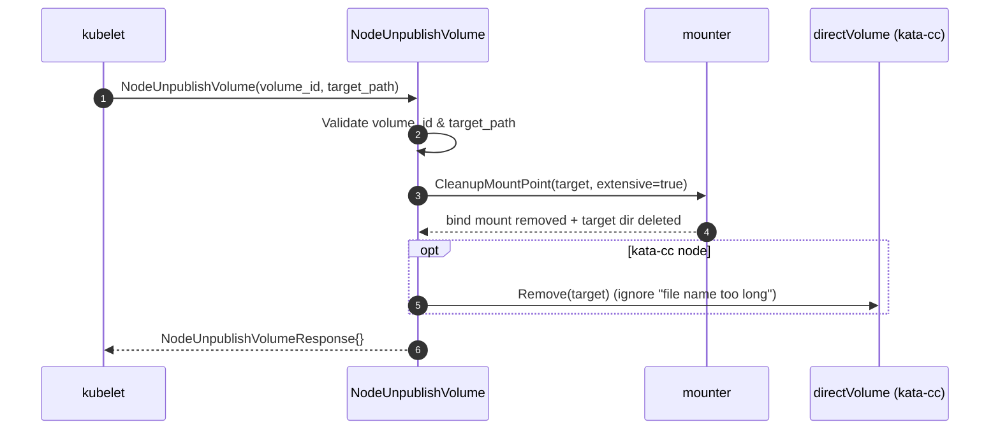
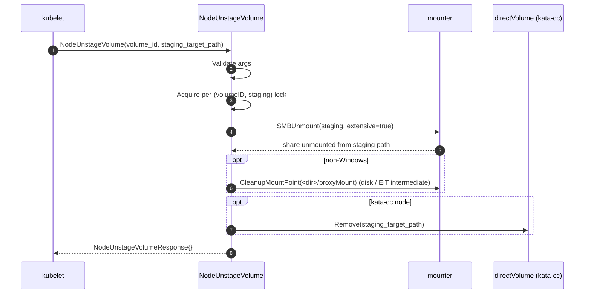

# NodeUnpublishVolume & NodeUnstageVolume Workflow

This document traces the node-side **teardown** path of the Azure File CSI
driver — the mirror of `NodePublishVolume` / `NodeStageVolume` — from the
kubelet's teardown gRPC calls through unmount logic to the responses returned.

The entry points live in
[`pkg/azurefile/nodeserver.go`](../pkg/azurefile/nodeserver.go):

- `Driver.NodeUnpublishVolume` (~L240) — unmounts the per-pod **bind mount**
  from the pod's **target** path.
- `Driver.NodeUnstageVolume` (~L676) — unmounts the per-node share from the
  **staging** path.

---

## 0. Where these fit in the CSI node lifecycle

```
kubelet (when a pod using the PV terminates)
   │
   ├─ NodeUnpublishVolume(volume_id, target_path)          ← reverse of NodePublishVolume
   │      → unmount the bind mount from the pod target path
   │
   └─ NodeUnstageVolume(volume_id, staging_target_path)    ← reverse of NodeStageVolume
          → unmount the actual CIFS/NFS share from the staging path
            (only after the LAST pod on the node has been unpublished)
```

`NodeUnpublishVolume` runs once per pod; `NodeUnstageVolume` runs once per node
after the last pod's bind mount is torn down.

---

## 1. NodeUnpublishVolume — flow

```
NodeUnpublishVolume()                          pkg/azurefile/nodeserver.go
   │
   ├─ 1. Validate volume_id and target_path present
   ├─ 2. CleanupMountPoint(target, extensiveMountPointCheck=true)
   │        → unmount the bind mount and remove the target directory
   ├─ 3. (kata-cc) directVolume.Remove(target)  — delete direct-volume mount info
   │        · "file name too long" error is ignored (treated as not present)
   └─ 4. Return NodeUnpublishVolumeResponse{}
```

Notes:
- There is **no per-volume lock** here; the operation is driven purely by
  `CleanupMountPoint`, which is idempotent (a missing/already-unmounted target
  is not an error).
- Only the bind mount is removed — the underlying share stays mounted at the
  staging path until `NodeUnstageVolume`.

### Sequence diagram — NodeUnpublishVolume



---

## 2. NodeUnstageVolume — flow

```
NodeUnstageVolume()                            pkg/azurefile/nodeserver.go
   │
   ├─ 1. Validate volume_id and staging_target_path present
   ├─ 2. Acquire per-(volumeID, stagingTargetPath) lock  → Aborted if held
   ├─ 3. SMBUnmount(stagingTargetPath, extensiveMountPointCheck=true, removeSMBMountOnWindows)
   │        → unmount the CIFS/NFS share from the staging path
   ├─ 4. (non-Windows) CleanupMountPoint(<dir>/proxyMount)
   │        → clean the intermediate proxy/VHD mount used for disk & EiT mounts
   ├─ 5. (kata-cc) directVolume.Remove(stagingTargetPath)  — delete mount info
   └─ 6. Return NodeUnstageVolumeResponse{}
```

Notes:
- **Per-operation lock** on `"<volumeID>-<stagingTargetPath>"` mirrors
  `NodeStageVolume`; a concurrent call returns `Aborted`
  (`volumeOperationAlreadyExists`).
- **`proxyMount` cleanup** (Linux only) removes the intermediate CIFS mount that
  NodeStageVolume created under `filepath.Dir(stagingTargetPath)/proxyMount` for
  VHD-disk (loopback) and Encryption-in-Transit (aznfs) mounts. It is a no-op
  when that path was never used.
- **Metrics:** success/failure is recorded via the CSI metric context
  (`node_unstage_volume`); `isOperationSucceeded` is only set true at the end.

### Sequence diagram — NodeUnstageVolume



---

## 3. Idempotency & error handling

- **Idempotent unmounts:** `CleanupMountPoint` / `SMBUnmount` treat an already
  unmounted or missing path as success, so repeated teardown calls are safe.
- **NodeUnpublishVolume** ignores the kata-cc `"file name too long"` error
  (returns success) since it indicates no direct-volume mount info was present.
- **Failures** during unmount surface as `Internal` errors, causing the kubelet
  to retry the teardown.
- **Ordering guarantee:** the kubelet only calls `NodeUnstageVolume` after all
  `NodeUnpublishVolume` calls for the volume on that node have succeeded, so the
  bind mounts are gone before the share is unmounted.

---

## 4. Responses

- **NodeUnpublishVolume** returns an empty `&csi.NodeUnpublishVolumeResponse{}`
  on success.
- **NodeUnstageVolume** returns an empty `&csi.NodeUnstageVolumeResponse{}` on
  success.

After both complete, the volume is fully detached from the node; the Azure file
share and storage account themselves are unaffected (their lifecycle is managed
by `CreateVolume` / `DeleteVolume`).
